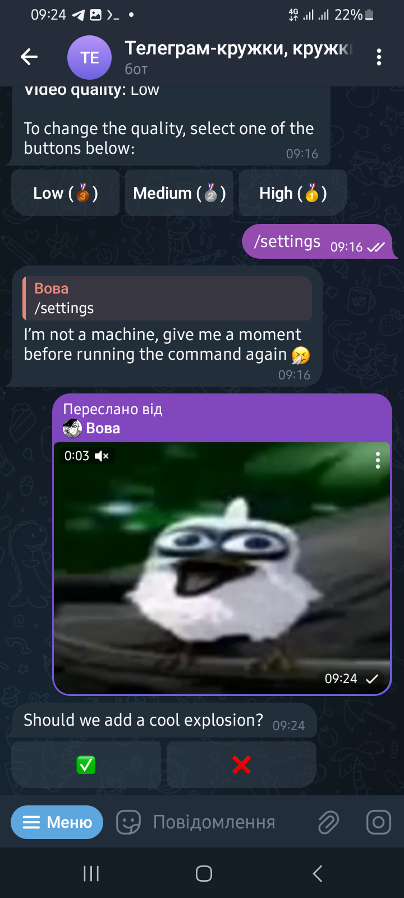

# VideoNoteBot

This bot allows you to turn videos into "video notes" (circular videos). You can also add an explosion effect or enhance the quality of an existing video note.

## Available Commands

- [/start](./commands/start.ts) - The initial command that provides basic information about how to use the bot.
- [/settings](./commands/settings.ts) - A command for changing the video note quality. You can also view the current quality settings.

## Features

- Localization for `ru`, `uk`, and `en` users (the language is determined by the phone number's registered `language code`).
- Ability to add an explosion effect to video notes or videos you send.
- Options to select the quality of the video note (`low`, `medium`, `high`; default is `medium`).
- Interactive feedback to show that the bot is working on the video, such as messages like `Processing video` or `Sending video`.
- Video caching to avoid reprocessing identical videos with the same settings, reducing server load.

## Usage Example (or rather, a video report showing that it works)

<div style="display: grid; grid-template-columns: repeat(2, 1fr); gap: 16px; justify-items: center;">
  </img>
  </img>
  </img>
  </img>
  </img>
  </img>
</div>

## Important Note

**If you want to replace the explosion effect with something else or change the video note conversion settings, you must ensure that the new effect matches the conversion settings. Otherwise, an error will occur.**

```js
const path = require("node:path");
const { convertToCircleVideo } = require("./dist/src/utils/converts.js");

(async () => {
  await convertToCircleVideo(
    "blast.mp4",
    path.resolve("uploads/assert/blast_low.mp4"),
    { quality: "low" },
  );

  await convertToCircleVideo(
    "blast.mp4",
    path.resolve("uploads/assert/blast_medium.mp4"),
    { quality: "medium" },
  );

  await convertToCircleVideo(
    "blast.mp4",
    path.resolve("uploads/assert/blast_high.mp4"),
    { quality: "high" },
  );
})();
```
